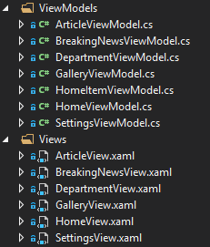

# SebastianToolkit
A toolkit for UWP apps, mainly used in the NzzApp. This is the reason why I published it, but of course you can contribute to this project, too. The main reason why I developed this toolkit is to provide a very basic MVVM pattern for Windows 10 apps. I do know about other toolkits, but I did not need a large range of functions and also wanted to learn something. This toolkit provides a bit more than MVVM, mainly basic stuff which is needed in common apps.

## Funcionality
- Basic MVVM (View/ViewModel-Mapping, dependency Injection, IoC)
- Page navigation
- Messaging pipeline between Views and ViewModels
- Basic data provider (SQLite)
- Some extensions and converters

## How it works
1. Your App.xaml and App.xaml.cs must inherit from `SebastianApplication`
2. Overwrite the abstract methods in App.xaml.cs. Example:

```cs
public override void SetupContainer(IoC container)
{
	// Register singletons here.
	// You don't have to register Views and ViewModels
	container.Singleton<IDataProvider, SQLiteDataProvider>();
	container.Singleton<ILiveTileProvider, LiveTileProvider>();
	container.Singleton<IDepartmentProvider, DepartmentProvider>();
	...
}

public override void NavigateToFirstView(INavigator navigator)
{
	// This navigates to the first view, in this case the HomeView
	navigator.Navigate<HomeViewModel>();
}
```
3. A View must implement `IView` and a ViewModel must implement `IViewModel` to support every feature. Best practice is to make a View inherit from the base class `View` and the ViewModel from the base class `ViewModel` (found in the `Sebastian.Toolkit.Application` namespace. It is very important that you meet the file structure requirement:

You can put groups of Views into another folder, but then you have to put the respective ViewModel in a folder with the same name under the ViewModels- folder.
4. Dependency Injection works as expected:
```cs
// Constructor of a ViewModel
public SettingsViewModel(ISettingsProvider settingsProvider, INavigator navigator)
{
	_settingsProvider = settingsProvider;
	_navigator = navigator;

	// Get a singleton without a constructor:
	var myProvider = IoC.GetInstance<IMyProvider>();
}
```
5. Navigation works best, when point 3 is respected. You need an instance of INavigator (just import it via dependency injection, it's already there) and do the following:
```cs
// Here we navigate to a department and provide a department as parameter. You don't have to provide a parameter.
_navigator.Navigate<DepartmentViewModel>(department);

// In the DepartmentViewModel we implement the method 'OnActivate' and receive the parameter there:
public override void OnActivated(object parameter)
{
	base.OnActivated(parameter);
	_department = (IDepartment) parameter;
}
```
5. Data storage: See the [NzzApp](https://github.com/seboschtion/NzzApp/tree/develop/NzzApp/NzzApp.Data) for a good example on how to use the SQLite wrapper.
6. Messaging pipeline: You can send messages from viewmodels to views and vice-versa.
Receive a message:
```cs
// Override the ReceiveMessage- method in your view oder viewmodel
public override void ReceiveMessage(object message) { ... }
```

Send a message:
```cs
// Just use the method
SendMessage("Hello");
```

## That's it
If you have questions or the toolkit does not work, don't worry and write to me. I know the documentation is very basic, but I think you get the idea and because it's small, you find some other features perhaps.
